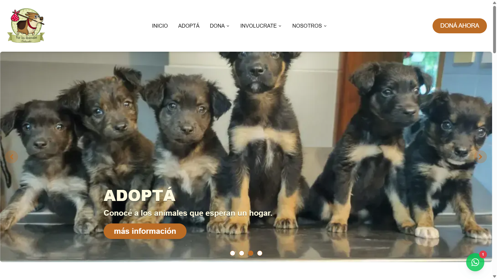
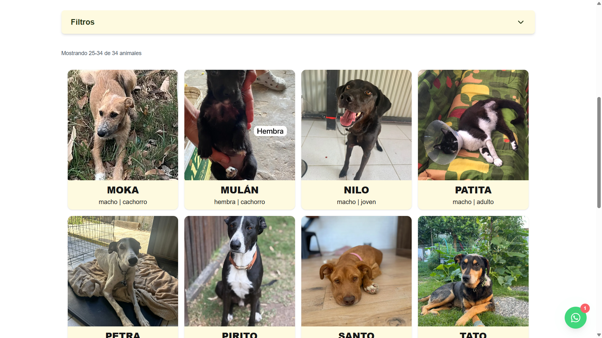
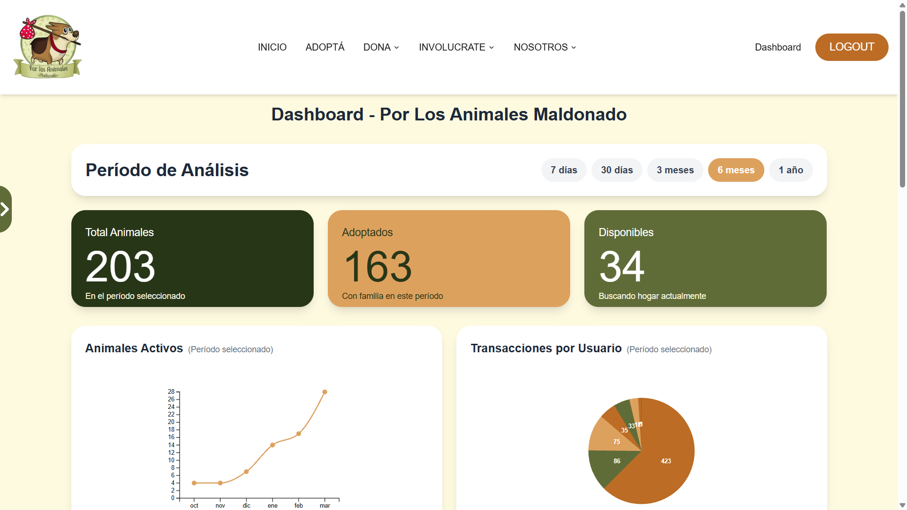
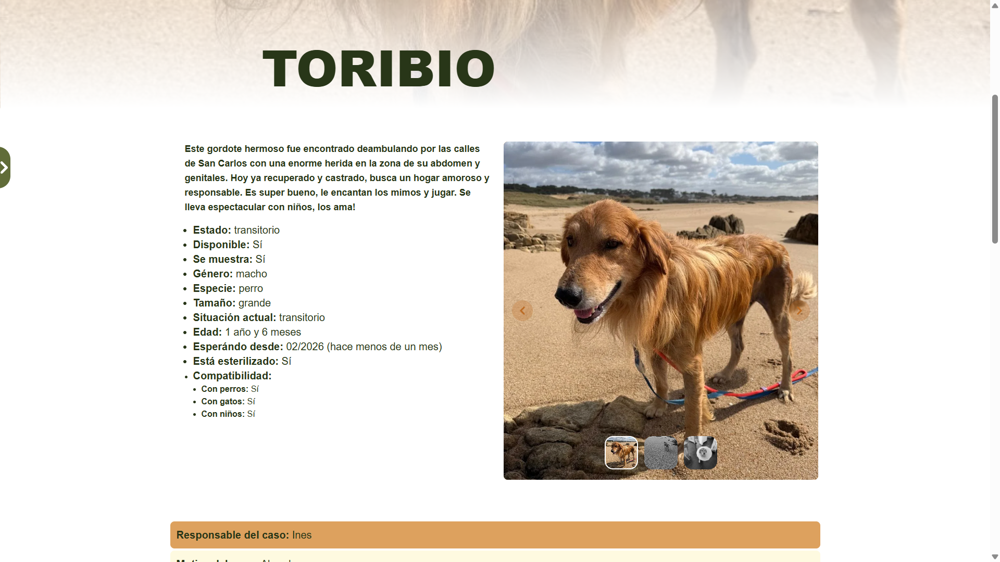
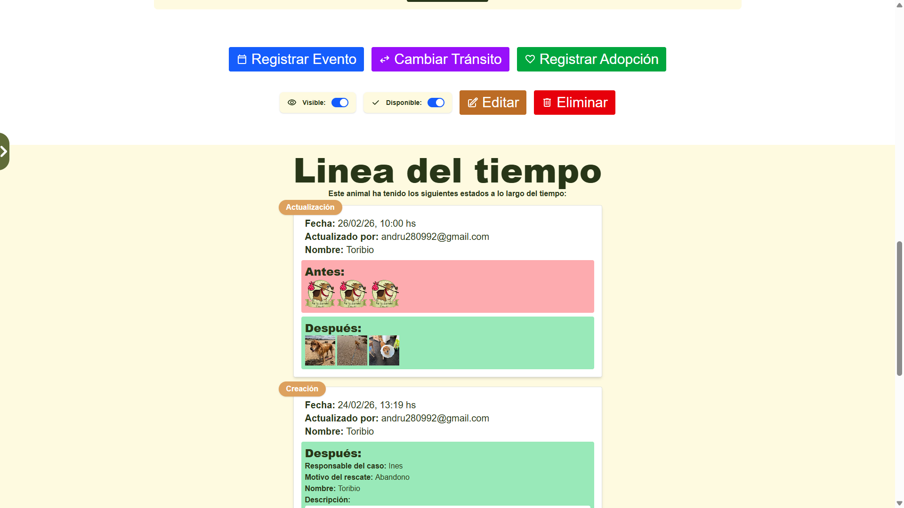
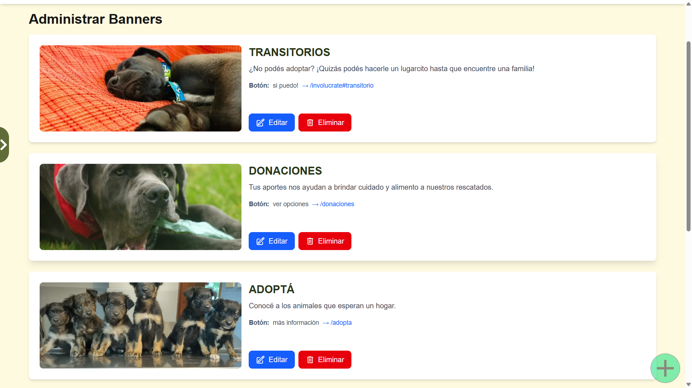

# Por los Animales Maldonado

Fullstack web system built for **Por los Animales Maldonado**, an animal rescue organization in Maldonado, Uruguay. It manages the full lifecycle of rescued animals — from intake to adoption — and includes an admin panel, a multi-gateway donation system, and social media outreach tools.

The application was developed **pro bono** to support the organization's rescue work.
It is currently **in production** and actively used by the team to manage real cases.

---

## Screenshots

|                   Homepage                   |                     Adoption Grid                      |
| :------------------------------------------: | :----------------------------------------------------: |
|  |  |

|                   Dashboard                    |                     Animal Detail                      |
| :--------------------------------------------: | :----------------------------------------------------: |
|  |  |

|                          Events & Timeline                          |                       Banner Management                        |
| :-----------------------------------------------------------------: | :------------------------------------------------------------: |
|  |  |

---

## Tech Stack

| Layer          | Technology                          |
| -------------- | ----------------------------------- |
| Framework      | Next.js 15 (App Router + Turbopack) |
| Language       | TypeScript (strict mode)            |
| Database       | Firebase Firestore                  |
| Authentication | Firebase Authentication             |
| Styling        | Tailwind CSS                        |
| Payments       | PayPal SDK, Mercado Pago            |
| Image hosting  | Cloudinary                          |
| Animations     | GSAP (ScrollTrigger, SplitText)     |
| Image capture  | html2canvas-pro                     |
| Edge security  | Cloudflare                          |
| Deploy         | Vercel                              |

---

## Main Features

### Animal Management

- Registration of rescued animals with detailed information
- Animal status tracking: street, shelter, foster home, adopted
- Separate private information: medical history, vaccines, case manager, medical conditions, notes
- Advanced filters by: name, species, size, gender, life stage, status
- Server-side sorting and pagination
- Public visibility and availability controls
- Soft delete and hard delete with restore option

### Event System & Timeline

Each animal has a full transaction history with specialized modals:

- Medical events
- Vaccination
- Sterilization
- Emergency
- Foster home change
- Adoption
- Return
- Death

The timeline is displayed as a chronological history within the animal detail view.

### Adoption System

- Public catalog of available animals with filters
- Detail page with photo carousel, auto-calculated age, compatibility info
- Adoption request modal integrated with external form
- Native share button (Web Share API)

### Donation System

- **Mercado Pago**: single donations with multiple amounts and monthly subscription
- **PayPal**: single donations and monthly subscriptions (8 plans)
- **MiDinero transfers**: account information
- **Commercial partnerships**: Costa Mascotas, Consentidos, Raciones La Coronilla
- **3Impacto community**: solidarity shields
- **Supply donations**: physical drop-off point
- Personalized thank-you page with donor name and amount

### Social Media Flyer Generator

Built-in tool to create outreach material for each animal:

- Custom color scheme selection
- Predefined formats: Instagram Stories (9:16) and Posts (3:4)
- Adjustable font size controls
- Data display toggles
- Dynamic QR code generation linking to the animal's profile
- High-resolution JPEG capture and download

### "Get Involved" Section

- Animal abuse reporting: step-by-step guide with official forms
- Spaying/neutering: free municipal program information
- Microchip identification info
- Foster home recruitment system
- Solidarity transport volunteer group
- Social media outreach info

### Site Content Management

The admin panel allows modifying site content without deploying code:

- Main carousel configuration (title, description, CTA, images)
- WhatsApp contact management
- Banner management

### User Management

Authentication system with Firebase Authentication.

Available roles:

- **User**: basic access
- **Rescatista**: animal management, event logging, case updates
- **Admin**: create rescatistas, manage site content, configure contacts, manage carousel
- **Super Admin**: full system access, create admins, total user management

### Audit System

Automatic logging of all CRUD operations on critical entities:

- Who performed the action
- What action was performed (create, update, delete)
- When it was performed
- Before and after state of the data

---

## System Architecture

```
Users
  │
  ▼
Cloudflare (edge security / WAF)
  │
  ▼
Vercel (deploy)
  │
  ▼
Next.js Server Components
  │
  ▼
Cache layer (use cache + cacheTag + cacheLife)
  │
  ▼
Firestore
```

The application uses Next.js Server Components to query the backend and optimize performance.

### Caching Strategy

To reduce reads to Firebase Firestore, the application uses the Next.js cache system through:

- `'use cache'`
- `cacheTag()`
- `cacheLife()`
- `revalidateTag()`

Collection queries are cached with configured lifetimes (`stale`, `revalidate`, `expire`) and invalidated automatically when data changes occur.

This enables:

- Improved latency
- Reduced Firestore read count
- Up-to-date data

### Security

The application uses Cloudflare as an edge security layer to:

- Block automated bots
- Filter suspicious user-agents
- Prevent access to sensitive routes
- Mitigate scraping and scanning attempts

Data security is additionally controlled through Firebase Firestore access rules.

### Database Collections

| Collection           | Purpose                                 |
| -------------------- | --------------------------------------- |
| `animals`            | Public animal data                      |
| `animalPrivateInfo`  | Private info (medical, contacts, notes) |
| `animalTransactions` | Change and event history                |
| `contacts`           | Organization WhatsApp contacts          |
| `banners`            | Main carousel banners                   |
| `users`              | Users and roles                         |
| `systemAuditLog`     | Audit log                               |

---

## Internal API

The system exposes internal Next.js endpoints to handle database queries with type safety via function overloads.

Query example:

```typescript
const result = await fetchAnimals({
  species: ['perro', 'gato'],
  size: ['pequeño', 'mediano'],
  sortBy: 'name',
  page: 1,
  limit: 12,
});
```

The API supports:

- Combined filters
- Multiple values per field
- Sorting
- Pagination
- Typed overloads that guarantee return type based on provided filters

---

## UI/UX Patterns

- Mobile-first responsive design
- Optimistic UI updates with rollback on error
- Minimum loading time (600ms) to prevent flashes
- Skeleton loading states
- Confirmation dialogs for destructive actions
- Toast notifications for user feedback

---

## Quick Start

Install dependencies:

```bash
pnpm install
```

Start the development server:

```bash
pnpm dev
```

Open [http://localhost:3000](http://localhost:3000) in your browser.

## Useful Scripts

- `pnpm dev` — Start the development server
- `pnpm build` — Build the app for production
- `pnpm lint` — Run the linter
- `pnpm docs` — Generate project documentation

---

## Project Documentation

The `/docs` folder contains important documentation about the system:

- **[ROLES_AND_PERMISSIONS.md](/docs/ROLES_AND_PERMISSIONS.md)** — Role-based access control (RBAC) system documentation
- **[AUDIT_LOG_SYSTEM.md](/docs/AUDIT_LOG_SYSTEM.md)** — Audit log system for tracking all changes in the application
- **[FIRESTORE_AUDIT_LOG_RULES.md](/docs/FIRESTORE_AUDIT_LOG_RULES.md)** — Firestore security rules for the audit log system

Additional auto-generated API documentation is available in the `/docs` folder using TypeDoc.

---

## Motivation

This project was developed pro bono to support the animal rescue work of Por los Animales Maldonado.

The goal was to create a tool that enables:

- Centralizing case management
- Improving rescue work organization
- Streamlining the adoption process
- Boosting social media outreach
- Simplifying fundraising

---

## Project Status

The system is currently in production and actively used by the organization.

To deploy the app, you can use [Vercel](https://vercel.com/) or your preferred platform.

## Resources

- [Next.js Documentation](https://nextjs.org/docs)
- [Firebase Documentation](https://firebase.google.com/docs)
- [Tailwind CSS Documentation](https://tailwindcss.com/docs)
